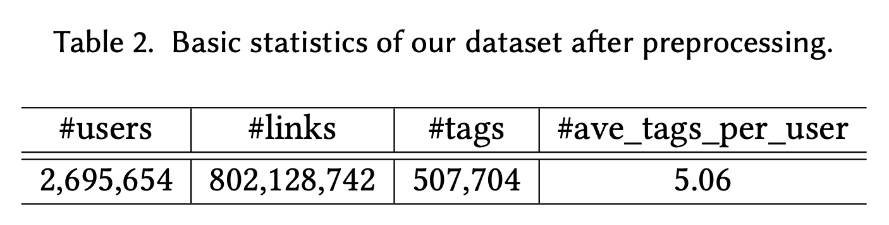

# Weibo Tagging
This repository contains the dataset and the source code for the TOIS paper "Learning Semantic Representations from Directed Social Links to Tag Microblog Users at Scale" (*Under revision*).

## Directory
- [Datasets](#Datasets)
- [Download and Usage](#Download-and-Usage)
- [License](#License)
- [Additional Notes](#Additional-Notes)

## Datasets

We have collected a large microblogging dataset from [SINA Weibo](https://weibo.com). We start with several users with a large number of inlinks (followers) or outlinks (followings) as seed users, and gradually extend the user set according their links. We crawl the tweets, profile, following links for these users. In the extension process, following [Ee-Peng Lim et.al.](https://dl.acm.org/citation.cfm?id=1871437.1871557), we use a series of simplified heuristic methods to filter the inactive or spam users:

* we remove the accounts who have published no more than three tweets;
* we remove the accounts who have no more than five followers;
* we remove the accounts who have published a large number of tweets in a short period (twenty tweets per day);
* we remove the accounts who have added advertisement keywords or e-commerce links in their tags, profiles and nicknames (e.g. company);
* we remove the accounts who have not published a tweet in recent month at crawl date;
* we remove the accounts who have published many very similar tweets;
* we remove the accounts who have a large number of retweets but very few original tweets.

We also remove unfrequent tags that are used by fewer than 100 users. We present the basic statistics of the final dataset in the following table.



The tag set is generated by merging the tags frequently adopted by the users. For privacy problem, we anonymized all users and tags by mapping them into random IDs.

## Download and Usage
- By using the datasets, you must agree to be bound by the terms of the following [license](#Licence).
- Then mail to [houyupeng@ruc.edu.cn](mailto:houyupeng@ruc.edu.cn) and cc Wayne Xin Zhao via [batmanfly@gmail.com](mailto:batmanfly@gmail.com) and your supervisor, and **copy the license in the email**. We will send you the datasets by e-mail when approved.

## License
By using the datasets, you must agree to be bound by the terms of the following license.

```
License agreement
This dataset is made freely available to academic and non-academic entities for non-commercial purposes such as academic research, teaching, scientific publications, or personal experimentation. Permission is granted to use the data given that you agree:
1. That the dataset comes “AS IS”, without express or implied warranty. Although every effort has been made to ensure accuracy, we do not accept any responsibility for errors or omissions. 
2. That you include a reference to the dataset in any work that makes use of the dataset. For research papers, cite our preferred publication as listed on our References; for other media cite our preferred publication as listed on our website or link to the dataset website.
3. That you do not distribute this dataset or modified versions. It is permissible to distribute derivative works in as far as they are abstract representations of this dataset (such as models trained on it or additional annotations that do not directly include any of our data) and do not allow to recover the dataset or something similar in character.
4. That you may not use the dataset or any derivative work for commercial purposes as, for example, licensing or selling the data, or using the data with a purpose to procure a commercial gain.
5. That all rights not expressly granted to you are reserved by us (Wayne Xin Zhao, School of Information, Renmin University of China).
```

## Additional Notes
- The following people contributed equally to this work: Yupeng Hou and Junhua Chen.
- If you have any questions or suggestions with this dataset, please feel free to contact us. Our goal is to make the dataset reliable and useful for the community.
- For contact, send email to [houyupeng@ruc.edu.cn](mailto:houyupeng@ruc.edu.cn), and cc Wayne Xin Zhao via [batmanfly@gmail.com](mailto:batmanfly@gmail.com).